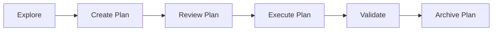

# Plans Directory

## Purpose
Store detailed implementation plans created during the PLAN phase of the Explore-Plan-Execute methodology.

## Structure

### `/current/`
Active plans currently being implemented. These should be:
- Detailed step-by-step implementation guides
- Risk assessments and mitigation strategies
- Success criteria and validation steps
- Rollback procedures if needed

### `/archive/`
Completed plans moved here for future reference. Organized by date and feature:
- `2024-01-15-payment-integration/`
- `2024-01-20-auth-system/`
- `2024-02-01-performance-optimization/`

## Plan Template

```markdown
# Plan: [Feature Name]

## Created: [Date]
## Author: Claude Code
## Status: [Planning|In Progress|Complete]
## Risk Level: [Low|Medium|High|Critical]

## Objective
[Clear description of what we're building]

## Success Criteria
- [ ] Criterion 1
- [ ] Criterion 2
- [ ] Criterion 3

## Implementation Steps

### Phase 1: [Name] (Estimated: X hours)
1. Step 1 with specific details
2. Step 2 with specific details
3. Step 3 with specific details

### Phase 2: [Name] (Estimated: X hours)
1. Step 1 with specific details
2. Step 2 with specific details

## Risk Mitigation
- **Risk 1**: [Description]
  - Mitigation: [Strategy]
- **Risk 2**: [Description]
  - Mitigation: [Strategy]

## Rollback Plan
1. How to revert if something goes wrong
2. Backup procedures
3. Recovery steps

## Validation
- [ ] All tests pass
- [ ] Linter clean
- [ ] Types valid
- [ ] Performance benchmarks met
- [ ] Security scan passed

## Notes
[Any additional context or considerations]
```

## Usage

### Creating a Plan
```bash
# After exploration phase
claude plan create --name "user-authentication" --risk high

# Save to current directory
claude plan save > .claude/plans/current/auth-plan.md
```

### Using a Plan
```bash
# Load plan for execution
claude execute --plan .claude/plans/current/auth-plan.md

# With context preservation
claude --continue --plan .claude/plans/current/auth-plan.md
```

### Archiving Plans
```bash
# After completion
mv .claude/plans/current/auth-plan.md \
   .claude/plans/archive/2024-01-15-auth-system/

# With metadata
claude plan archive --name auth-plan --tag completed
```

## Best Practices

1. **Always plan before complex implementation**
2. **Include rollback procedures for risky changes**
3. **Update plans if requirements change**
4. **Archive completed plans with outcomes**
5. **Reference archived plans for similar features**

## Integration with Workflow



## Remember

> "A plan is a bridge between understanding and implementation. Build it strong."